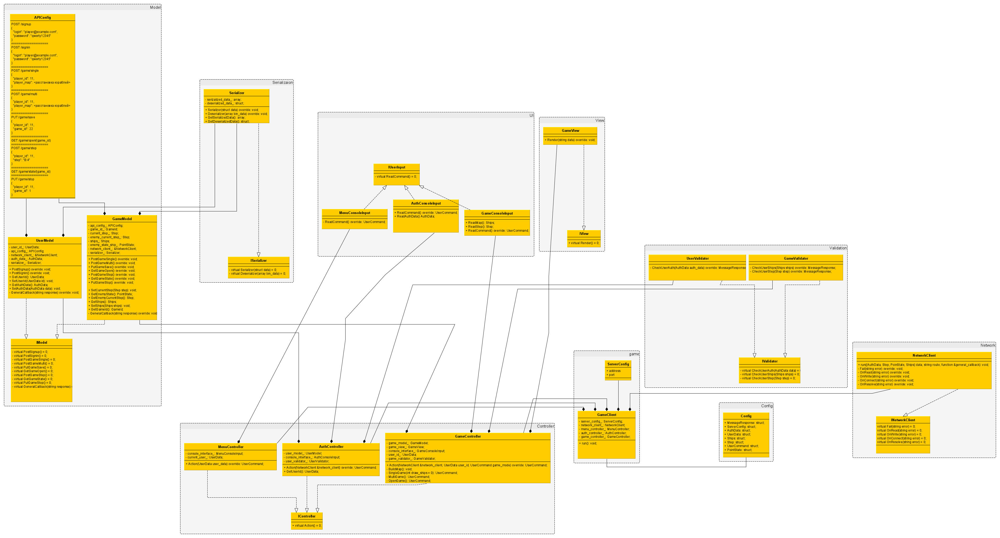
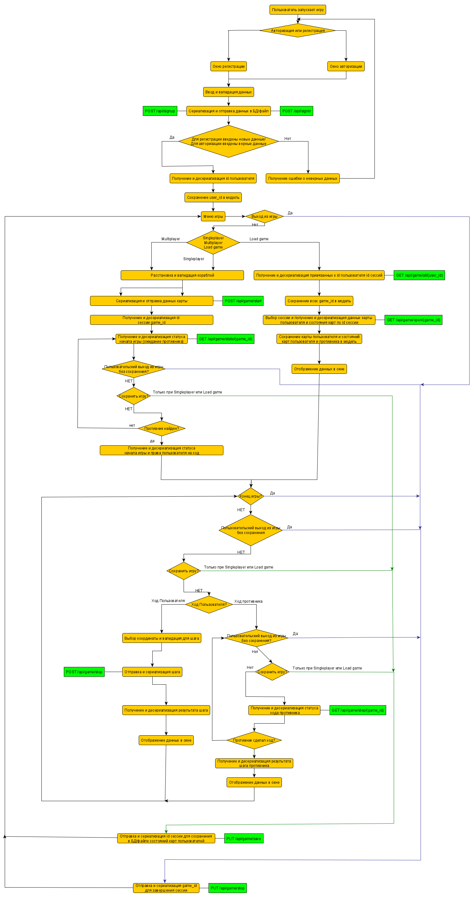

# Клиентская часть проекта "Морской бой".

Swagger JSON API: https://app.swaggerhub.com/apis/rufa-a/APISeaBattle/1.0.0-oas3

UML-диаграмма классов: 

Схема алгоритма логики работы клиентской части:

Вместо POST, PUT, GET HTTP запросов используется TCP-сокет для передачи структуры данных, в которой роут и тип запроса указаны в дополнительной переменной (см. `struct DataRequest`/`struct DataResponse` и `enum Route`).

  - MVC-архитектура 
      - контроллеры: 
        - MenuController
        - AuthController
        - GameController
      - модели:
        - UserModel
        - GameModel
      - представление:
        - GameView
  - Асинхронная работа с сетью
      - библиотека boost: https://github.com/boostorg/boost
      - TCP сокет
      
      
  Например, регистрация пользователя:
  
   1. В объекте `GameClient` вызывается метод `run` с бесконечным циклом, который завершается при выходе из игры или при отключении соединения.
   2. В цикле выбирается определенный контроллер в зависимости от возвращаемой команды пользователя. 
   3. При идентификации вызывается метод `Action` объекта `AuthController`. 
   4. В методе производится выбор регистрации или авторизации (метод `ReadCommand`). 
   5. Далее вызывается `ReadAuthData`, который возвращается введенные данные. 
   6. В методе вызывается `CheckUserAuth` объекта `UserValidator`, который возвращает, правильно ли были введены данные.
   7. Вызывается метод `PostSignup` объекта модели `UserModel`. 
   8. Проводится сериализация данных в объекте `Serializer`, где вызываются методы `Serializer` для сериализации данных и `GetSerializedData` для возврата этих данных.
   9. Вызывается метод `run` объекта `NetworkClient`. В методе производится серия асинхронных вызовов сопоставления доменного имени и IP-адреса, соединения с сетью, отправки данных и чтения полученных данных, после чего вызывается функция отбратного вызова, которая была передана по ссылке для записи данных в существующий объект модели `UserModel`. Десериализируются полученные данные объектом `Serializer`. Десериализованные данные записываются в модель.
   10. После регистрации метод объекта `AuthController` возвращает команду для выбора меню контроллера.
   11. Вызыватеся метод `Action` объекта `MenuController` и т.д.
  
